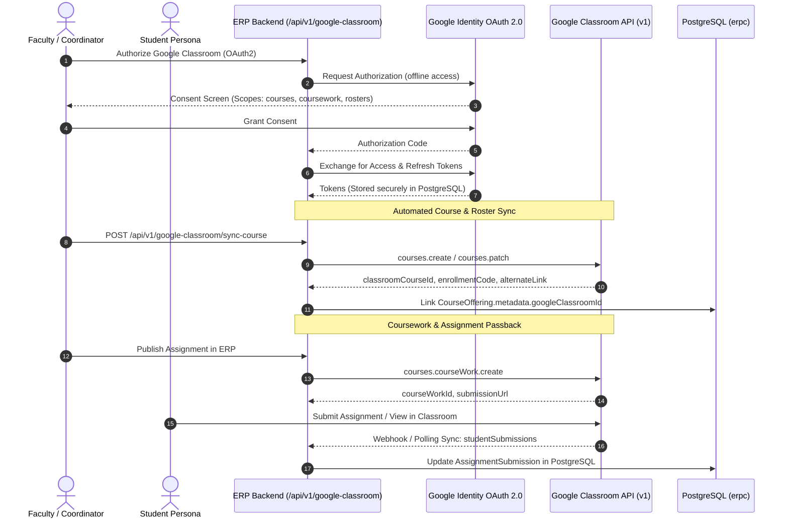

# 🌐 Google Classroom API Integration & Architecture

This document defines the architectural specification, data synchronization protocol, OAuth 2.0 security model, and API endpoints for the **Google Classroom LMS Integration** in the University ERP.

---

## 1. Overview & Architecture

The Google Classroom integration enables real-time, two-way synchronization between the University ERP academic engine and Google Classroom. It facilitates automated class creation, roster enrollment, assignment distribution, and grade passback.



---

## 2. OAuth 2.0 & Security Compliance

### Credentials & Environment Configuration
In accordance with Google Cloud security best practices, sensitive client secrets and API keys must **never** be hardcoded in frontend code or repository commits.

```ini
# Backend Environment Configuration (.env)
GOOGLE_CLIENT_ID=your-google-client-id.apps.googleusercontent.com
GOOGLE_CLIENT_SECRET=your-google-client-secret
GOOGLE_API_KEY=your-google-cloud-api-key
GOOGLE_REDIRECT_URI=http://localhost:5000/api/v1/google-classroom/callback
GOOGLE_FRONTEND_ORIGIN=http://localhost:3000
```

### Required OAuth 2.0 Scopes
* `https://www.googleapis.com/auth/classroom.courses`: Manage and view course offerings.
* `https://www.googleapis.com/auth/classroom.rosters`: Manage and view teacher and student rosters.
* `https://www.googleapis.com/auth/classroom.coursework.students`: Manage assignments and grades.
* `https://www.googleapis.com/auth/classroom.announcements`: Publish announcements.
* `https://www.googleapis.com/auth/userinfo.email`: Read authorized user email.
* `https://www.googleapis.com/auth/userinfo.profile`: Read user display name and avatar.

### Security Directives
1. **Server-Side Token Exchange**: The frontend initiates OAuth by redirecting to `/api/v1/google-classroom/auth-url`. Google sends the authorization code strictly to the backend callback endpoint.
2. **Encrypted Token Storage**: OAuth `access_token` and `refresh_token` are stored in database records or encrypted sessions.
3. **No Query Parameter Exposure**: API requests to Google APIs must transport keys via the `x-goog-api-key` header or Authorization Bearer tokens.

---

## 3. Data Model Mapping & Invariants

| ERP Entity (PostgreSQL) | Google Classroom Resource | Sync Direction | Key Attributes |
|---|---|---|---|
| `CourseOffering` | `courses` | ERP $\rightarrow$ Google Classroom | `name`, `section`, `room`, `enrollmentCode`, `alternateLink` |
| `Teacher` / `Faculty` | `courses.teachers` | ERP $\rightarrow$ Google Classroom | `userId`, `profile.name`, `role: TEACHER` |
| `Student` / `Enrollment` | `courses.students` | ERP $\rightarrow$ Google Classroom | `userId`, `studentId`, `profile.emailAddress` |
| `Assignment` | `courses.courseWork` | ERP $\leftrightarrow$ Google Classroom | `title`, `description`, `dueDate`, `maxPoints`, `workType: ASSIGNMENT` |
| `AssignmentSubmission` | `courses.courseWork.studentSubmissions` | Google Classroom $\rightarrow$ ERP | `state`, `assignedGrade`, `alternateLink`, `attachments` |

---

## 4. REST API Endpoint Specifications

### 1. `GET /api/v1/google-classroom/auth-url`
* **Access**: Authenticated Faculty / Admin / Student (`AuthGuard`).
* **Response**: Returns the Google OAuth 2.0 authorization URL with required offline scopes.

### 2. `GET /api/v1/google-classroom/callback`
* **Access**: Public Google OAuth redirect.
* **Query**: `code`, `state`.
* **Action**: Exchanges code for tokens, verifies user email, and links Google Identity.

### 3. `GET /api/v1/google-classroom/courses`
* **Access**: Faculty / Student (`AuthGuard`).
* **Response**: Returns list of synced Google Classroom courses with direct `alternateLink` deep-links.

### 4. `POST /api/v1/google-classroom/sync-offering`
* **Access**: Faculty / Academic Admin (`RoleGuard(['TEACHER', 'ADMIN', 'SUPER_ADMIN'])`).
* **Payload**: `{ offeringId: string }`.
* **Action**: Creates or patches corresponding Google Classroom course, invites faculty as primary teacher, and returns class code.

### 5. `POST /api/v1/google-classroom/sync-coursework`
* **Access**: Faculty (`RoleGuard(['TEACHER', 'ADMIN'])`).
* **Payload**: `{ assignmentId: string }`.
* **Action**: Publishes ERP coursework assignment to Google Classroom stream with due date and attachments.

### 6. `POST /api/v1/google-classroom/import-grades`
* **Access**: Faculty / Exam Controller.
* **Payload**: `{ offeringId: string, assignmentId: string }`.
* **Action**: Fetches submitted grades from Google Classroom and populates `AssignmentSubmission.obtainedMarks` in PostgreSQL.
