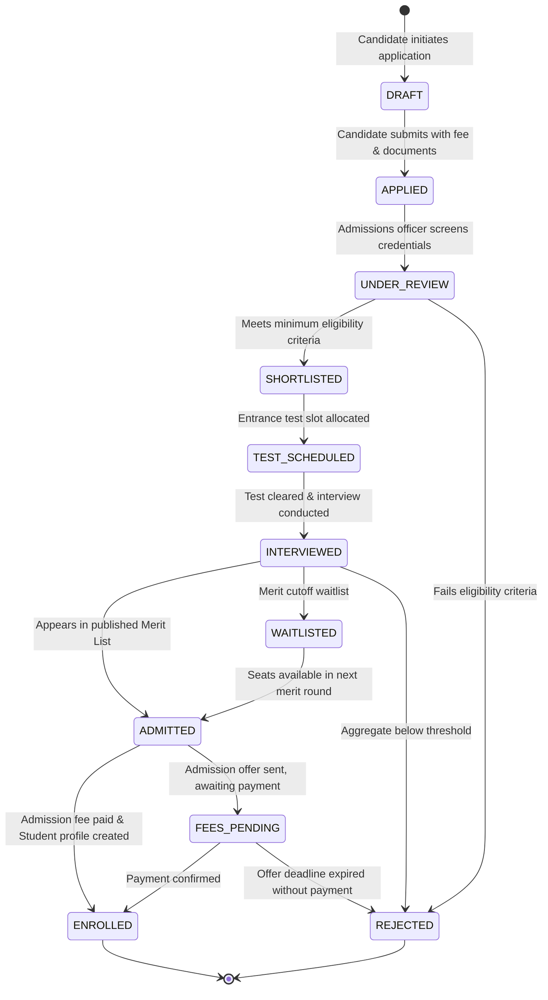
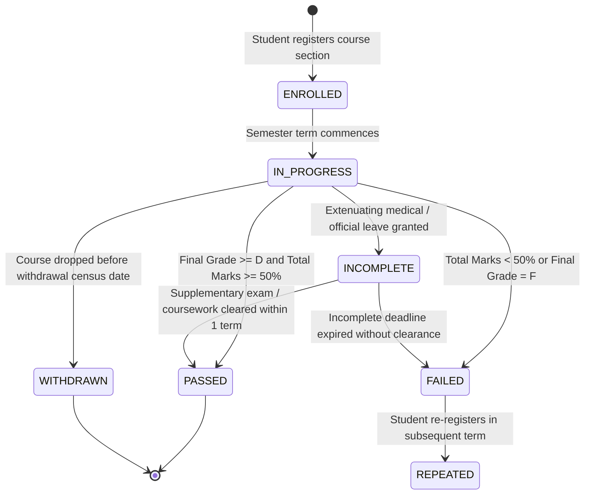
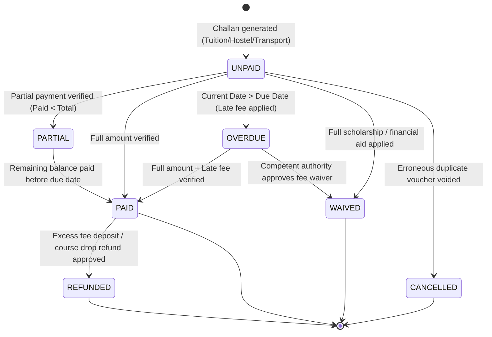
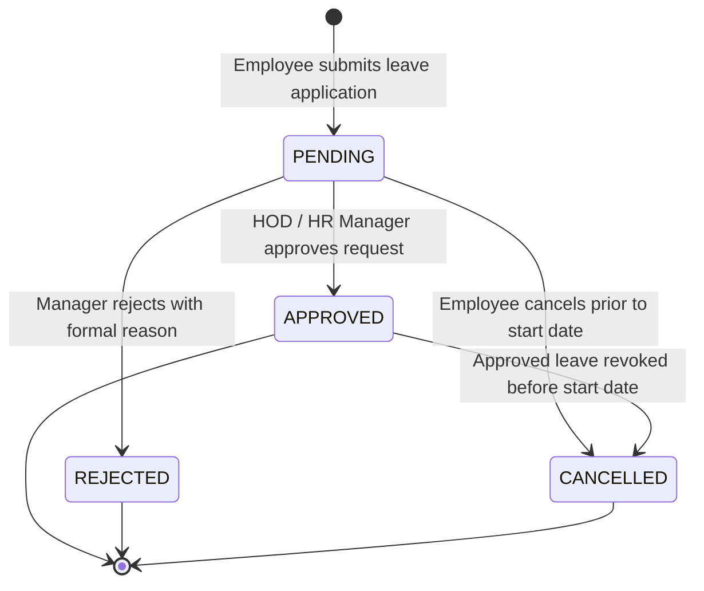
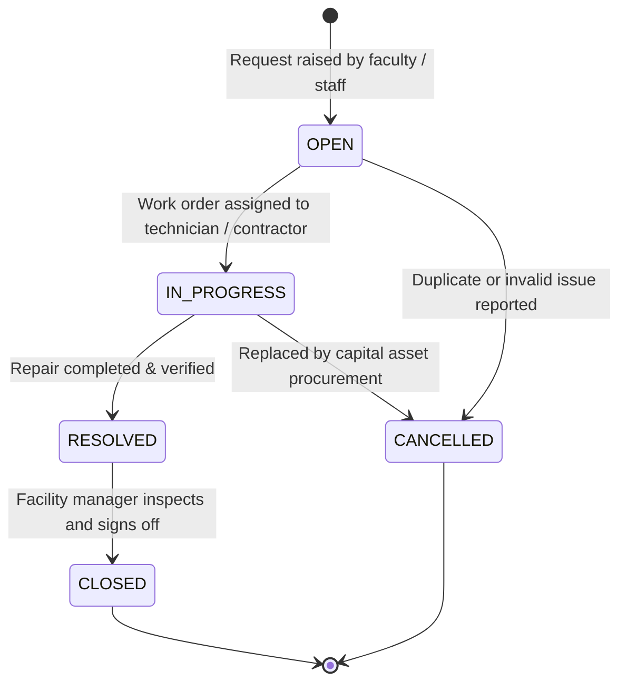
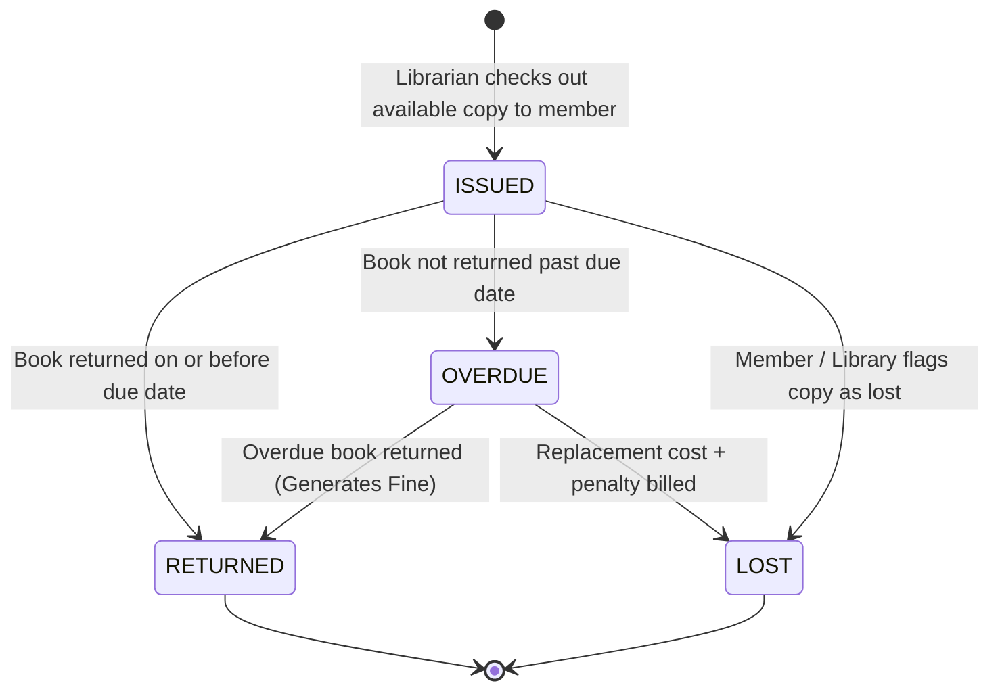
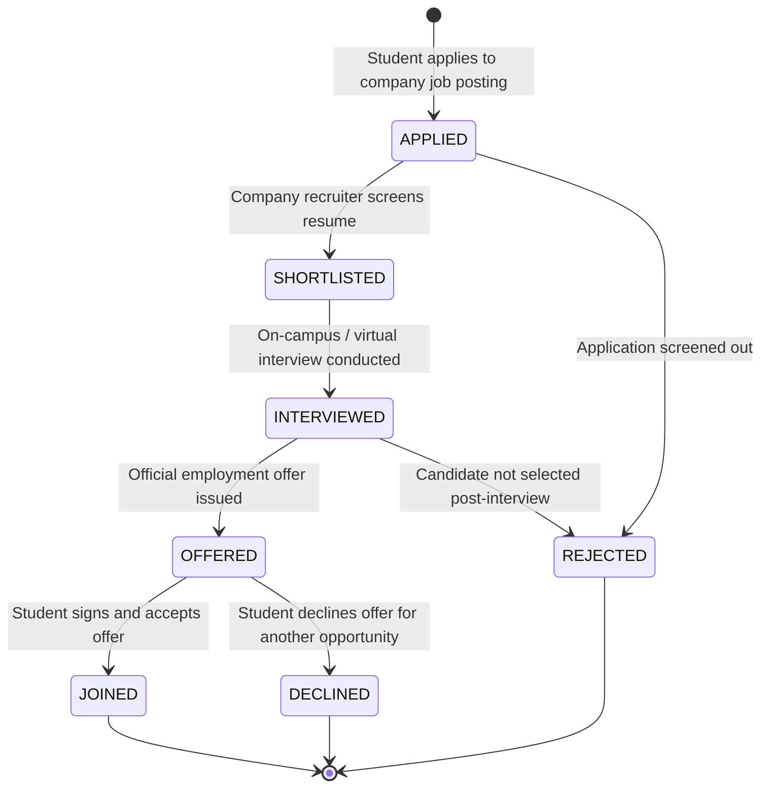

# University / College ERP — Complete State Machines Specification

This document defines the lifecycle states, transition triggers, guards, validation rules, and side-effects for all stateful business entities in the University / College Management ERP system.

---

## 1. Admissions Application Lifecycle (`ApplicationStatus`)

### Transition Rules & Guards
* **`DRAFT` $\rightarrow$ `APPLIED`**: Requires mandatory fields (CNIC/Passport, prior transcripts, program choice).
* **`ADMITTED` $\rightarrow$ `ENROLLED`**: Triggers atomic creation of `User` (with `STUDENT` role), `Student` profile, and initial semester enrollment.

---

## 2. Course Enrollment & Academic Standing (`EnrollmentStatus` & `AcademicStanding`)

### Academic Standing Progression
* **`GOOD_STANDING`**: Semester GPA $\ge 2.00$ and CGPA $\ge 2.00$.
* **`PROBATION`**: CGPA drops below $2.00$. Warning issued; max credit hours capped to 12.
* **`SUSPENDED`**: 2 consecutive terms on probation without achieving CGPA $\ge 2.00$.
* **`GRADUATED`**: All degree requirements fulfilled ($100\%$ required credits earned, CGPA $\ge 2.00$).

---

## 3. Fee Billing & Challan Lifecycle (`FeeStatus`)

### Side-Effects & Event Hooks
* **`PAID` Event**: Automatically updates student account ledger, increments `Account` balance, and unlocks course registration / transcript generation.
* **`OVERDUE` Event**: Triggers fine calculation and automated SMS/Email reminders via `Notification`.

---

## 4. Employee Leave Workflow (`LeaveStatus`)

### Transition Guards
* **Balance Check**: `totalDays` requested must be $\le$ `LeaveBalance.remainingDays` for that specific `LeaveType` in the current year.
* **Approval Hook**: On `APPROVED`, atomic transaction deducts `totalDays` from `LeaveBalance.usedDays` and `remainingDays`.

---

## 5. Facility Maintenance Work Orders (`MaintenanceStatus`)

---

## 6. Library Book Circulation & Fines (`BookIssueStatus`)

### Fine Calculation Rule
$$\text{Fine Amount} = (\text{Return Date} - \text{Due Date}) \times \text{Daily Fine Rate}$$
Book copy transitions back to `AVAILABLE` upon inspection unless damaged.

---

## 7. Career Placement & Internship Lifecycle (`PlacementStatus`)

