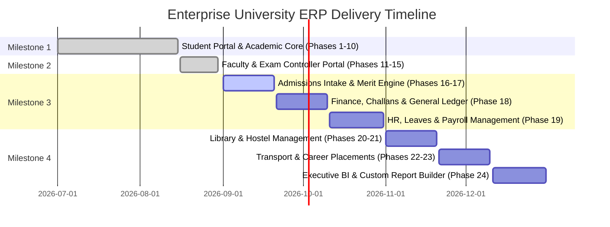

# 📋 Enterprise University ERP — Master Implementation TODO & Roadmap Checklist

This document provides a comprehensive, granular task breakdown and status audit across all 12 modules, 24 development phases, and 4 high-level milestones of the University & College Management ERP system.

---

## 📊 High-Level Milestone Summary

| Milestone | Scope / Focus | Status | Phases | Completion |
|---|---|:---:|:---:|:---:|
| **Milestone 1** | **Core Academic Spine & Student Portal** | ✅ **COMPLETED** | Phases 1 – 10 | **100%** |
| **Milestone 2** | **Faculty & Examination Controller Portal** | ✅ **COMPLETED** | Phases 11 – 15 | **100%** |
| **Milestone 3** | **Admissions, Finance & HR Management** | ⏳ **UPCOMING** | Phases 16 – 19 | **0%** |
| **Milestone 4** | **Campus Operations, Facilities & Advanced BI** | ⏳ **UPCOMING** | Phases 20 – 24 | **0%** |
| **Infrastructure** | **Cloud Storage, RBAC, CI/CD & Testing** | 🟡 **IN PROGRESS** | Global | **75%** |

---

## ✅ Milestone 1: Student Portal & Academic Spine (Completed)

- [x] **Phase 1: Identity & Profile Management**
  - [x] JWT RS256/HS256 access and refresh token lifecycle.
  - [x] Role-Based Access Control (`roleGuard`) and permission validation.
  - [x] Student profile view and personal information editor.
  - [x] Digital student identity badge with QR code simulation.
- [x] **Phase 2: Student Dashboard Overview**
  - [x] Interactive CGPA Meter with academic standing classification.
  - [x] Enrolled courses summary cards with credit hour indicators.
  - [x] Attendance percentage ring and warning indicators (< 75%).
  - [x] Unread notifications and university announcements feed.
- [x] **Phase 3: Course Registration Engine**
  - [x] Semester course offering section browser.
  - [x] Directed Acyclic Graph (DAG) prerequisite verification.
  - [x] Timetable clash and section capacity validator.
  - [x] Add/Drop registration submission to PostgreSQL.
- [x] **Phase 4: Multi-Semester Transcript Engine**
  - [x] 8-Semester interactive transcript browser.
  - [x] Real-time GPA/CGPA recalculation algorithm.
  - [x] Academic probation flags and dean's honor list badges.
- [x] **Phase 5: Attendance Tracker**
  - [x] Subject-wise attendance percentages with color-coded alerts.
  - [x] Detailed lecture date absence logs.
- [x] **Phase 6: LMS & Assessments**
  - [x] AWS S3 document repository for syllabus PDFs and lecture slides.
  - [x] Cloudinary CDN high-definition video lecture streaming player.
  - [x] Student homework submission dropzone with direct S3 upload links.
  - [x] Timed quiz attempt engine with instant result reviews.
- [x] **Phase 7: Examination & Results**
  - [x] Published semester terminal datesheet schedule.
  - [x] Digital Exam Hall Ticket with QR validation and dues clearance check.
  - [x] Official semester result card browser.
- [x] **Phase 8: Fee & Billing Management**
  - [x] Itemized semester fee challan voucher breakdowns.
  - [x] Printable PDF Challan generator with bank copy and student copy.
  - [x] Real-time payment verification status indicators.
- [x] **Phase 9: Weekly Timetable Grid**
  - [x] Color-coded 5-day interactive class matrix.
  - [x] Room and laboratory allocations with instructor details.
- [x] **Phase 10: Official Documents & Communication Hub**
  - [x] Verifiable digital student ID card.
  - [x] Campus announcements broadcast reader.

---

## ✅ Milestone 2: Faculty & Examination Controller Portals (Completed)

- [x] **Phase 11: Faculty Workload & Schedule Dashboard**
  - [x] Aggregated weekly teaching workload hours (18 hrs/week).
  - [x] Active course offering sections with student capacity tracking.
  - [x] Weekly teaching timetable schedule matrix.
  - [x] Quick-action grading queue and attendance shortcuts.
- [x] **Phase 12: Daily Class Attendance Marker**
  - [x] Session date selector and lecture topic input.
  - [x] 1-Click "Mark All Present" shortcut.
  - [x] Granular status toggles: `PRESENT`, `ABSENT`, `LATE`, `EXCUSED`.
  - [x] Bulk atomic attendance submission to PostgreSQL with audit logging.
- [x] **Phase 13: Coursework & Assessment Builder**
  - [x] Assignment creator with title, description, due date, and max marks.
  - [x] Submissions grading desk with AWS S3 file downloads and rubric scoring.
  - [x] Timed quiz builder with question banks and duration limits.
  - [x] AWS S3 course materials and Cloudinary video lecture publisher.
- [x] **Phase 14: Sessional Gradebook Entry**
  - [x] Itemized sessional marks matrix (Sessional 20% + Midterm 30% + Final 50%).
  - [x] Automated weighted total and letter grade calculator (`A`, `B+`, `C`, `F`).
  - [x] Secure mark sheet transmission to the Examination Controller.
- [x] **Phase 15: Examination Controller Portal**
  - [x] Active terminal exam term configuration and metadata tracker.
  - [x] Semester datesheet publisher with room and time slot scheduler.
  - [x] Exam invigilation staff duty assignments.
  - [x] Statistical GPA distribution review and **Immutable Grade Lock Engine**.
  - [x] Digital hall ticket clearance validation.

---

## ✅ Milestone 3: Admissions, Finance & HR Management (Completed)

### 📋 Phase 16: Public Online Admissions & Applicant Intake Portal (Completed ✅)
- [x] **Backend Tasks**:
  - [x] Implement `admissionsService.js` and `admissionsController.js`.
  - [x] API `POST /api/v1/admissions/apply`: Public applicant intake form with document uploads (Matric/FSc/A-Levels transcripts to AWS S3).
  - [x] API `GET /api/v1/admissions/applications/:trackingId`: Application tracking status with real-time stage tracker (`SUBMITTED`, `UNDER_REVIEW`, `TEST_SCHEDULED`, `ACCEPTED`, `REJECTED`).
  - [x] API `GET /api/v1/admissions/admin/applications`: Admissions officer applicant review workstation.
  - [x] API `PATCH /api/v1/admissions/admin/applications/:id/status`: Stage transition with automated email/SMS dispatch.
- [x] **Frontend Tasks**:
  - [x] Public Application Portal: `frontend/src/app/admissions/apply/page.tsx` (Multi-step wizard: Personal Info, Academic History, Degree Preferences, S3 Document Dropzone, Payment Receipt).
  - [x] Application Status Tracker: `frontend/src/app/admissions/track/page.tsx`.
  - [x] Admissions Officer Workstation: `frontend/src/app/admin/admissions/page.tsx`.

---

### 📊 Phase 17: Entrance Exam & 50/50 Merit Ranking Engine (Completed ✅)
- [x] **Backend Tasks**:
  - [x] Implement `meritRankingService.js` with 50/50 aggregate math:
    $$\text{Aggregate} = (0.50 \times \text{Academic Percentage}) + (0.50 \times \text{Entry Test Percentage})$$
  - [x] API `POST /api/v1/admissions/tests/scores`: Bulk entry test score upload (CSV / Excel parser).
  - [x] API `POST /api/v1/admissions/merit-lists/generate`: Automated ranking generator partitioned by program quotas.
  - [x] API `GET /api/v1/admissions/merit-lists/public`: Public downloadable merit list PDFs.
- [x] **Frontend Tasks**:
  - [x] Merit List Generator & Previewer in Admissions Officer Portal.
  - [x] Public Merit List Browser with real-time seat quota countdown (`/admissions/merit-lists`).

---

### 💳 Phase 18: Finance, Billing & Double-Entry Accountant Portal (Completed ✅)
- [x] **Backend Tasks**:
  - [x] Implement `financeService.js` and `accountantController.js`.
  - [x] API `POST /api/v1/finance/fee-structures`: Fee structure templates (Tuition per credit hour, lab charges, library dues, admission fees).
  - [x] API `POST /api/v1/finance/challans/generate-batch`: Batch semester challan generator for thousands of enrolled students.
  - [x] API `POST /api/v1/finance/payments/reconcile-bank`: CSV bank scroll importer for automated payment reconciliation.
  - [x] API `GET /api/v1/finance/general-ledger`: Double-entry Chart of Accounts ledger (Assets, Liabilities, Revenue, Expenses).
- [x] **Frontend Tasks**:
  - [x] Accountant Dashboard: `frontend/src/app/accountant/dashboard/page.tsx`.
  - [x] Batch Challan Dispatcher & PDF Generator.
  - [x] Bank Scroll Reconciliation Workstation.
  - [x] General Ledger & Trial Balance Viewer.

---

### 👔 Phase 19: HR & Master Workforce Management Portal (Completed ✅)
- [x] **Backend Tasks**:
  - [x] Implement `hrService.js` and `hrController.js`.
  - [x] API `GET /api/v1/hr/employees`: Unified employee directory specialized into Faculty, Admin Staff, and Drivers.
  - [x] API `POST /api/v1/hr/employees`: Onboard new employee with contract terms, designation, and salary scale.
  - [x] API `GET /api/v1/hr/leaves`: Leave requests queue (Casual, Sick, Annual, Sabbatical).
  - [x] API `PATCH /api/v1/hr/leaves/:id/review`: Approve/reject leave with automatic balance deductions.
  - [x] API `POST /api/v1/hr/payroll/generate-slips`: Monthly salary slip generator with allowances, tax deductions, and provident fund.
- [x] **Frontend Tasks**:
  - [x] HR Manager Portal: `frontend/src/app/hr/dashboard/page.tsx`.
  - [x] Employee Master Directory with department filtering.
  - [x] Leave Approval Workstation with quota balances.
  - [x] Monthly Payroll & Salary Slips Generator.

---

## ⏳ Milestone 4: Campus Operations, Facilities & Advanced BI (Upcoming)

### 📚 Phase 20: Library Circulation Automation System (Completed ✅)
- [x] **Backend Tasks**:
  - [x] Implement `libraryService.js` (`/api/v1/library/*`).
  - [x] Book cataloging with ISBN, Dewey Decimal Classification, and barcoded copy inventories.
  - [x] Circulation desk: Instant checkout, return, and overdue fine calculation.
- [x] **Frontend Tasks**:
  - [x] Librarian Workstation: `frontend/src/app/librarian/dashboard/page.tsx`.
  - [x] Student OPAC (Online Public Access Catalog) Search Interface.

---

### 🏢 Phase 21: Hostel & Residential Life Management (Completed ✅)
- [x] **Backend Tasks**:
  - [x] Implement `hostelService.js` (`/api/v1/hostels/*`).
  - [x] Hostel buildings (Boys/Girls/Faculty), room tiers, and bed allocation contracts.
  - [x] Student check-in, check-out, and room change requests.
- [x] **Frontend Tasks**:
  - [x] Hostel Warden Portal: `frontend/src/app/warden/dashboard/page.tsx`.
  - [x] Interactive 3D/Grid Room & Bed Allocation Matrix.

---

### 🚌 Phase 22: Transport Fleet Management & Commuter Passes (Completed ✅)
- [x] **Backend Tasks**:
  - [x] Implement `transportService.js` (`/api/v1/transport/*`).
  - [x] Bus fleet inventory, driver assignments, route stops, and pickup timings.
  - [x] Student/Staff semester transit subscriptions with digital QR bus passes.
- [x] **Frontend Tasks**:
  - [x] Fleet Manager & Driver Portal: `frontend/src/app/transport/dashboard/page.tsx`.
  - [x] Interactive Bus Route Map with pickup stop schedules.

---

### 💼 Phase 23: Career Placements & Research Grants (Completed ✅)
- [x] **Backend Tasks**:
  - [x] Implement `placementService.js` (`/api/v1/placements/*`) & `researchService.js` (`/api/v1/research/*`).
  - [x] Campus recruitment job postings, student applications, and interview schedules.
  - [x] Faculty research projects, grant funding allocations, and DOI publication tracking.
- [x] **Frontend Tasks**:
  - [x] Career Placement Hub: `frontend/src/app/career/page.tsx`.
  - [x] University Research & Publication Portal.

---

### 📈 Phase 24: Dynamic BI Analytics & Custom Report Builder
- [ ] **Backend Tasks**:
  - [ ] Implement `biReportingService.js` (`/api/v1/reporting/*`).
  - [ ] High-performance read queries for Institutional KPIs (Retention rates, Fee collection recovery %, Faculty teaching workload, Department GPA trends).
  - [ ] Dynamic custom report builder with SQL projection generator and scheduled exports (PDF, Excel, CSV).
- [ ] **Frontend Tasks**:
  - [ ] Executive BI Executive Dashboard: `frontend/src/app/admin/bi/page.tsx`.
  - [ ] Custom Drag-and-Drop Report Query Builder.

---

## 🛠️ Infrastructure, Testing & Security Hardening

- [ ] **Real-Time Notification Pipeline**:
  - [ ] WebSocket / Server-Sent Events (SSE) stream mounted at `/api/v1/notifications/stream`.
  - [ ] Multi-channel push dispatch (In-App Toast, Email via SMTP/SendGrid, SMS via Twilio).
- [ ] **Automated Testing Suite ($\ge 85\%$ Code Coverage)**:
  - [ ] Vitest unit tests for academic prerequisite DAGs and GPA calculation math.
  - [ ] Supertest integration tests for all 12 REST controller endpoints.
  - [ ] Playwright E2E tests for student course registration and faculty attendance workflows.
- [ ] **DevOps & Production Containerization**:
  - [ ] `docker-compose.yml` orchestrating `backend`, `frontend`, `postgres:16-alpine`, `redis:7-alpine`, and `nginx-proxy`.
  - [ ] GitHub Actions CI/CD workflow validating linting, migrations, and automated test passes.

---

## 📅 Suggested Implementation Sequencing

